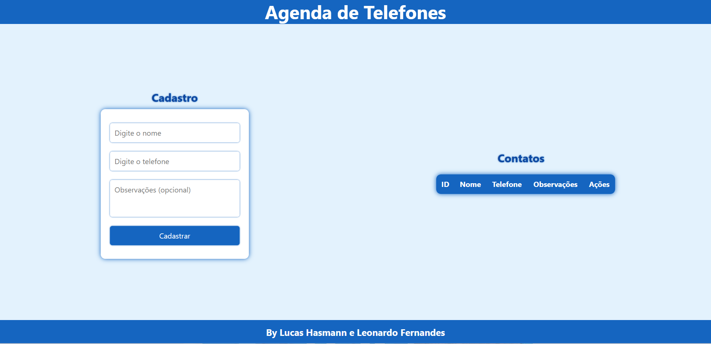

# Agenda de Telefones

Este projeto é uma aplicação full-stack para armazenar e gerenciar contatos telefônicos. Ele foi criado para permitir o cadastro, visualização e exclusão de números de telefone, incluindo informações como nome, número e observações.




## Tecnologias Usadas

### Frontend:
- **HTML**: Para estruturar as páginas.
- **CSS**: Para estilizar o layout e tornar as páginas visualmente agradáveis.
- **JavaScript**: Para adicionar interatividade e lógica no lado do cliente.

### Backend:
- **Node.js**: Ambiente de execução para JavaScript no lado do servidor.
- **Express**: Framework minimalista para Node.js, utilizado para criar o servidor web e lidar com rotas.

### Banco de Dados:
- **MySQL**: Sistema de gerenciamento de banco de dados relacional usado para armazenar os contatos da agenda.

### Ferramentas:
- **Git**: Sistema de controle de versão utilizado para gerenciar e versionar o código.
- **VSCode**: Editor de código-fonte recomendado para desenvolvimento, com suporte para Node.js e integração com Git.

## Estrutura do Banco de Dados

O banco de dados **agenda** contém uma tabela chamada **telefones** com as seguintes colunas:

### Tabela: telefones
| Nome da Coluna | Tipo de Dado  | Descrição |
|---------------|--------------|------------|
| telefone_id   | INTEGER      | Identificador único para cada telefone (auto incremento) |
| telefone      | VARCHAR(20)  | Número de telefone armazenado |
| nome         | VARCHAR(100) | Nome do contato associado ao telefone |
| obs          | VARCHAR(255) | Observações adicionais sobre o contato |

## Requisitos

Antes de começar, você precisa instalar as seguintes ferramentas no seu ambiente de desenvolvimento:

- **Git**: Ferramenta de controle de versão. Você pode baixar [aqui](https://git-scm.com/).
- **Node.js**: Ambiente de execução para JavaScript no servidor. Instale a versão mais recente do Node.js [aqui](https://nodejs.org/).
- **MySQL**: Sistema de gerenciamento de banco de dados. Você pode baixar [aqui](https://www.mysql.com/).
- **VSCode**: Editor de código-fonte. Baixe [aqui](https://code.visualstudio.com/).

## Como Testar o Banco de Dados

### 1. Clone o Repositório
Primeiro, clone o repositório para sua máquina local:
```sh
 git clone https://github.com/SEU_USUARIO/agenda-telefones.git
 cd agenda-telefones
```

### 2. Instale as Dependências
Se você estiver configurando o backend com Node.js, vá para o diretório do projeto no terminal e instale as dependências com o seguinte comando:
```sh
npm install
```
Isso vai instalar todos os pacotes necessários listados no `package.json`.

### 3. Crie o Banco de Dados
Abra o terminal MySQL e execute o seguinte comando para criar o banco de dados:
```sql
CREATE DATABASE agenda;
USE agenda;

CREATE TABLE telefones(
    telefone_id INTEGER PRIMARY KEY AUTO_INCREMENT,
    telefone VARCHAR(20) NOT NULL,
    nome VARCHAR(100) NOT NULL,
    obs VARCHAR(255)
);
```

### 4. Executar o Backend
Para iniciar o servidor, use o comando:
```sh
npm start
```
O servidor ficará rodando localmente (geralmente em `http://localhost:4000`).

